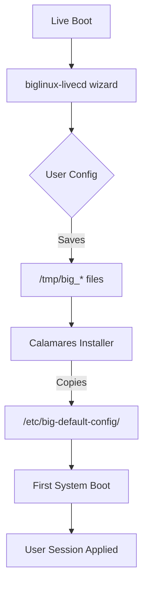

<div align="center">

# 🚀 BigLinux LiveCD

**The Ultimate Live Environment & Installer for BigLinux**

[](LICENSE)
[](https://www.biglinux.com.br/)
[](https://gtk.org/)
[](https://python.org/)

</div>

---

## 📖 Table of Contents

- [Overview](#-overview)
- [Key Features](#-key-features)
- [Architecture](#-architecture)
- [Project Structure](#-project-structure)
- [Supported Variants](#-supported-variants)
- [Boot Commands](#-custom-boot-commands-grub)
- [Development](#-development)
- [License](#-license)

---

## 📋 Overview

The **biglinux-livecd** package serves as the backbone of the BigLinux live experience. It orchestrates everything from the initial boot sequence to the final installation on the user's machine.

Upon booting, users are welcomed by a polished setup wizard (built with GTK4/Libadwaita) that allows for immediate personalization of the live session—settings that are seamlessly preserved after installation.

---

## 🚀 Key Features

- **Intuitive Setup Wizard**: Configure language, keyboard, and theme before you even reach the desktop.
- **Seamless Migration**: All settings chosen in the live environment are automatically carried over to the installed system.
- **Smart Hardware Detection**: Automatically enables enhancements like **JamesDSP** for audio and ICC profiles for displays.
- **Unified Installer**: Includes `calamares-biglinux`, a customized version of the Calamares installer tailored for BigLinux.

---

## 🏗️ Architecture

The configuration flow ensures a smooth transition from live media to permanent installation:



### Configuration Storage

| File | Description |
|------|-------------|
| `/tmp/big_language` | System locale (e.g., `pt_BR.UTF-8`) |
| `/tmp/big_keyboard` | X11 Keyboard Model and Layout |
| `/tmp/big_desktop_theme` | Selected visual theme |
| `/tmp/big_enable_jamesdsp` | Audio enhancement flag |

---

## 📁 Project Structure

This repository is organized to separate the live session logic from the installer components:

```tree
biglinux-livecd/
├── pkgbuild/                 # Arch Linux packaging files
├── locale/                   # Translations (.po files)
└── biglinux-livecd/usr/
    ├── bin/
    │   ├── startbiglive      # Main entry point for live session
    │   └── calamares-biglinux # Installer wrapper script
    ├── share/biglinux/
    │   ├── livecd/           # Setup Wizard Source (Python/GTK4)
    │   └── calamares/        # Installer UI Source
    └── lib/calamares/        # Custom Calamares modules
```

---

## 🎯 Supported Variants

BigLinux supports multiple desktop environments, automatically detected by the live system:

| Variant | Detection Trigger |
|---------|-------------------|
| **BigLinux (KDE)** | Default fallback |
| **Community GNOME** | `/usr/bin/startgnome-community` |
| **Community Cinnamon** | `/usr/bin/startcinnamon-community` |
| **Community XFCE** | `/usr/bin/startxfce-community` |

---

## 🔧 Custom Boot Commands (GRUB)

For advanced users and debugging, you can bypass the standard flow using the `biglinux.bootcmd` kernel parameter.

**Example:**
```bash
linux /vmlinuz-linux ... biglinux.bootcmd=only-calamares
```

| Command | Action |
|---------|--------|
| `boot-in-plasma` | Skip wizard, go straight to desktop |
| `only-calamares` | Launch installer directly (minimal mode) |
| `only-konsole` | Launch terminal only (rescue mode) |

---

## 🛠️ Development

### Prerequisites

- Arch Linux or Manjaro based system
- `makepkg` toolchain
- Python 3.12+ and GTK4 development libraries

### Build & Install

```bash
cd pkgbuild
makepkg -si
```

### Testing the UI

Run the setup wizard in a windowed mode for rapid iteration:

```bash
# Preview via Broadway (Web)
gtk4-broadwayd :5 &
GDK_BACKEND=broadway BROADWAY_DISPLAY=:5 python3 /usr/share/biglinux/livecd/main.py
# Open http://localhost:8085
```

---

## 🤝 Contributing

Contributions are welcome! Please follow these steps:

1. Fork the repository.
2. Create a feature branch (`git checkout -b feature/amazing-feature`).
3. Commit your changes (`git commit -m 'Add amazing feature'`).
4. Push to the branch (`git push origin feature/amazing-feature`).
5. Open a Pull Request.

---

## 📄 License

Distributed under the **GPL-3.0 License**. See [LICENSE](LICENSE) for more information.

---

<div align="center">

**Made with 💚 by the BigLinux Team**

[Website](https://biglinux.com.br)

</div>
